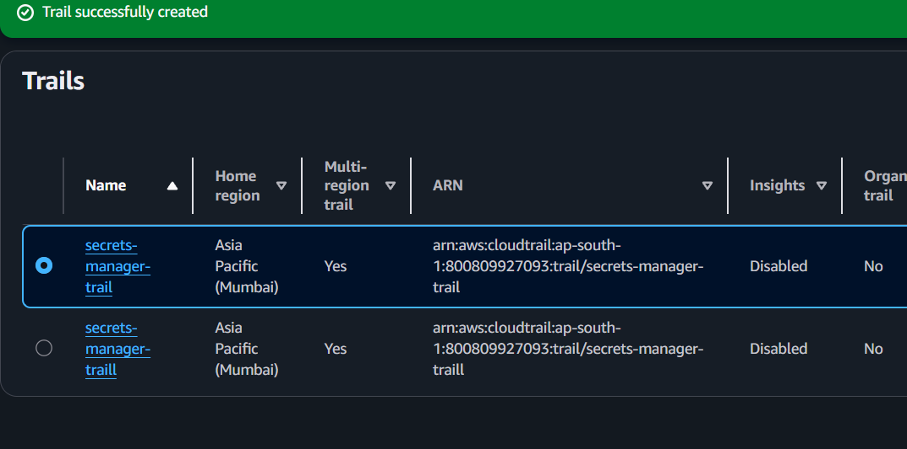
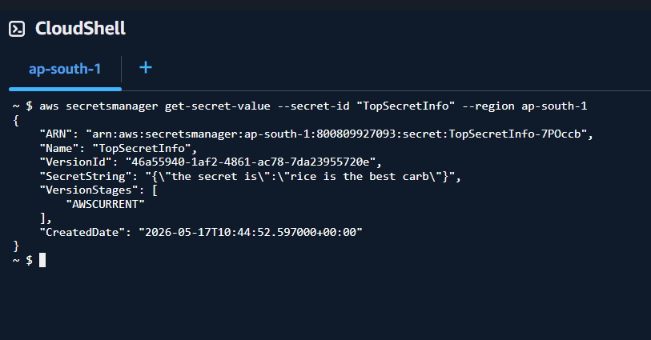
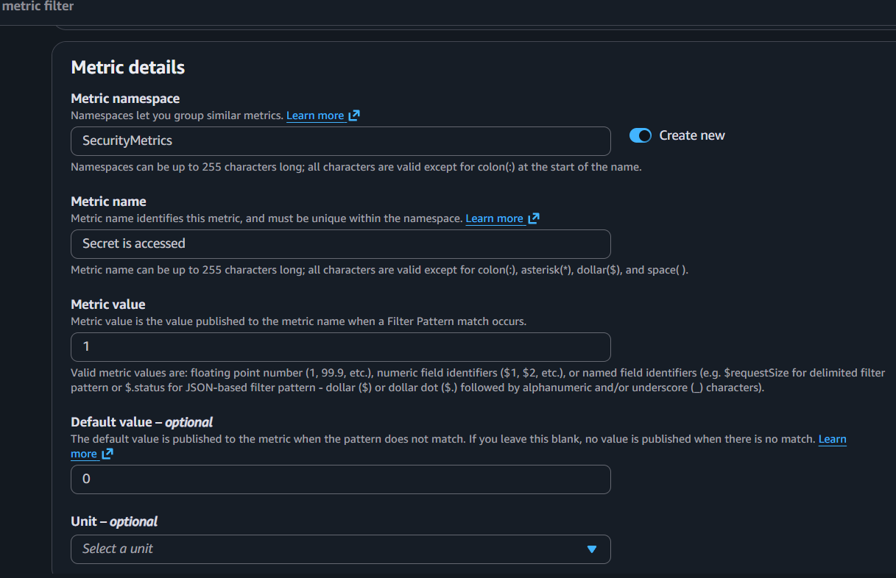
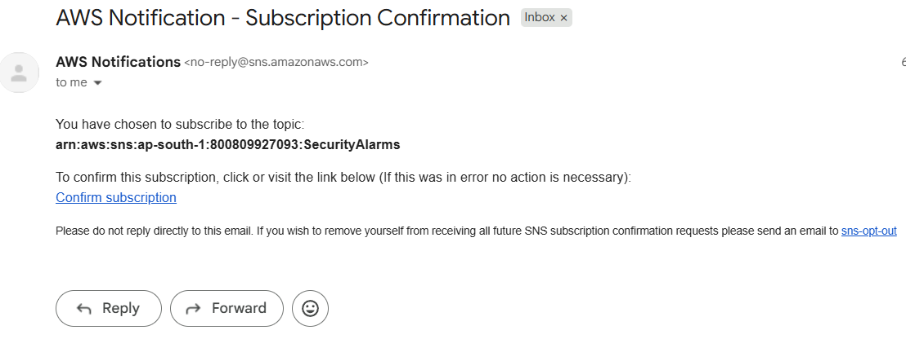
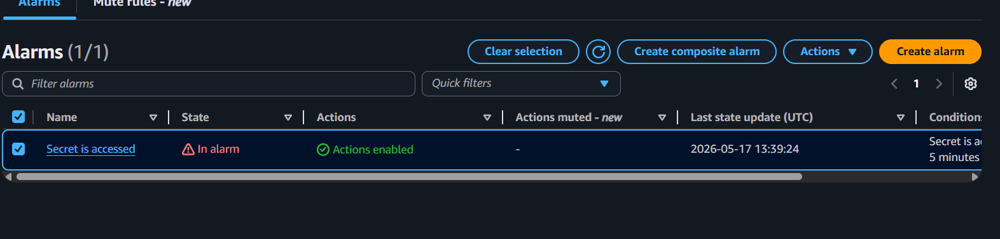
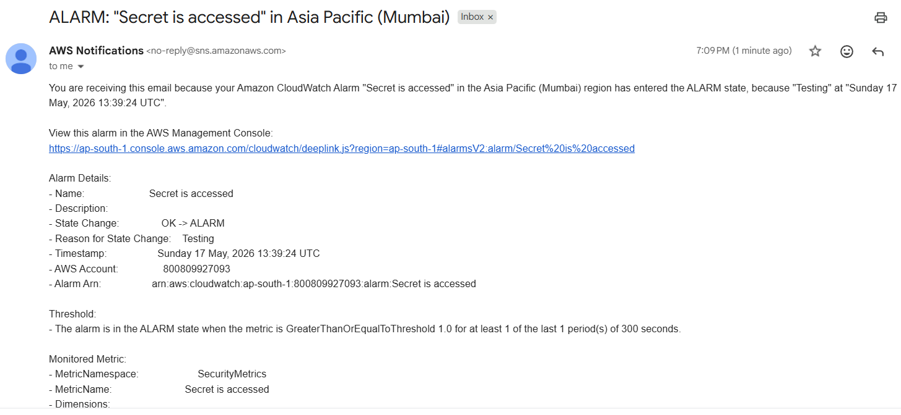

#  AWS Security Monitoring System

A real-time security monitoring system built on AWS that detects and alerts when sensitive secrets are accessed. The system automatically sends email notifications whenever a secret stored in AWS Secrets Manager is retrieved.

---

##  Architecture

```
Secrets Manager → CloudTrail → CloudWatch Logs → Metric Filter → Alarm → SNS → Email Alert
```

---

##  AWS Services Used

| Service | Purpose |
|---|---|
| AWS Secrets Manager | Securely stores sensitive credentials and secrets |
| AWS CloudTrail | Records all API activity across the AWS account |
| Amazon S3 | Stores CloudTrail log files |
| Amazon CloudWatch Logs | Receives and stores logs forwarded from CloudTrail |
| CloudWatch Metric Filter | Scans logs for GetSecretValue events |
| CloudWatch Alarm | Triggers when secret access is detected |
| Amazon SNS | Sends real-time email notifications |

---

##  Project Steps

###  Step 1 — Create a Secret
Created a secret called `TopSecretInfo` in AWS Secrets Manager using a key-value pair. This is the sensitive resource being monitored throughout the project.


---

###  Step 2 — Configure CloudTrail
Set up a CloudTrail trail called `secrets-manager-trail` to record all management events across the AWS account (Asia Pacific - Mumbai region). Logs are stored in a dedicated S3 bucket.



---

###  Step 3 — Generate Secret Access Events
Accessed the secret two ways to generate CloudTrail events:
- Via the AWS Management Console (Retrieve secret value)
- Via AWS CLI using CloudShell:

```bash
aws secretsmanager get-secret-value --secret-id "TopSecretInfo" --region ap-south-1
```



---

###  Step 4 — Set Up CloudWatch Metric Filter
- Enabled CloudWatch Logs integration on the CloudTrail trail
- Created a metric filter with pattern `"GetSecretValue"` to detect secret access events
- Configured metric: namespace `SecurityMetrics`, metric name `Secret is accessed`, value `1`, default `0`



---

###  Step 5 — Create CloudWatch Alarm and SNS Topic
- Created a CloudWatch Alarm that triggers when the `Secret is accessed` metric is ≥ 1 in a 5-minute period
- Created an SNS topic called `SecurityAlarms`
- Subscribed an email address to receive notifications
- Confirmed the SNS email subscription



---

###  Step 6 — Test and Verify
- Retrieved the secret again to trigger the alarm
- CloudWatch alarm moved to **In Alarm** state
- Received an email notification from AWS SNS within minutes





---

##  Results

- Successfully built an end-to-end AWS security monitoring pipeline
- CloudTrail captured every `GetSecretValue` API call
- CloudWatch metric filter correctly identified secret access events
- Alarm triggered and email notification delivered in real time

---

##  Cleanup

All AWS resources were deleted after the project to avoid ongoing charges:
- CloudTrail trail deleted
- S3 bucket deleted
- CloudWatch alarm and log group deleted
- Secrets Manager secret deleted
- SNS topic and subscription deleted

---

##  Key Concepts Learned

- **Least privilege IAM roles** — CloudTrail was given only the permissions needed to write to CloudWatch Logs
- **Management vs Data events** — `GetSecretValue` is a management event, making it easy to monitor without extra cost
- **Metric filters** — Pattern matching on log data to create actionable metrics
- **SNS pub/sub model** — Decoupled notification system that can scale to multiple subscribers
- **End-to-end troubleshooting** — Debugged the full pipeline from CloudTrail → CloudWatch → SNS

---

## 🛠️ Skills Demonstrated

`AWS` `CloudTrail` `CloudWatch` `SNS` `Secrets Manager` `S3` `IAM` `Security Monitoring` `Cloud Architecture` `DevOps`
